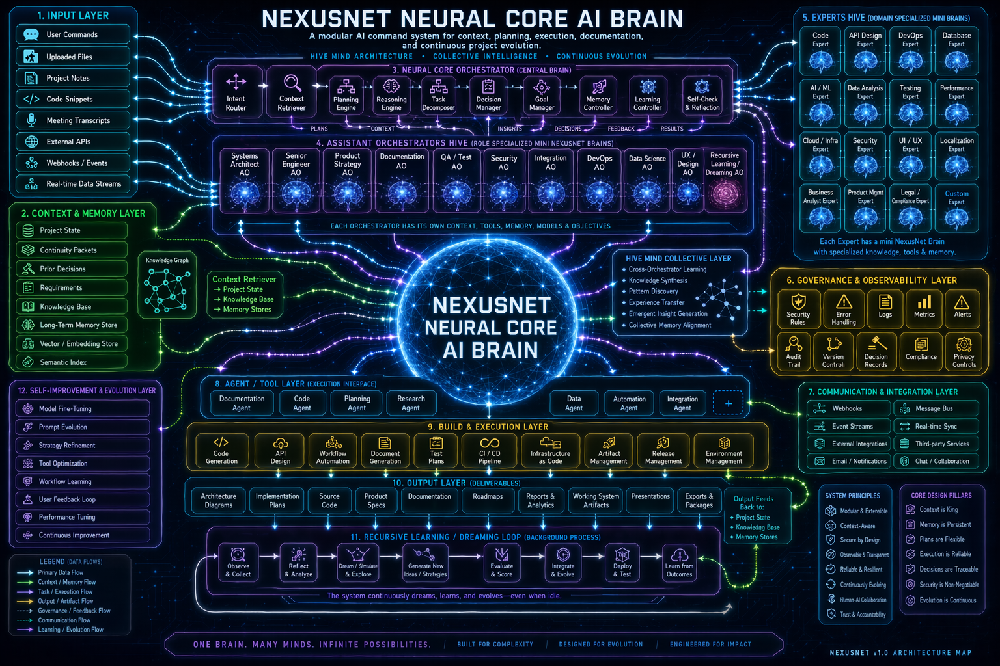

# NexusNet Neural Core AI Brain

A modular AI command system for context, planning, execution, documentation, and continuous project evolution.

---

## 🧠 Architecture Overview



---

NexusNet is the neural wrapper/core.
Nexus is the surrounding platform and host layer around that core.

This repository is now organized around that split.

## What Exists Now

Phase 1 establishes a runnable local-first NexusNet foundation:

- canonical `nexusnet/` package for the neural wrapper/core
- attached-model adapters and canonical `NexusBrain.generate()` path
- startup, model-load, inference, and benchmark telemetry logs
- brain memory cortex for episodic, semantic, benchmark, curriculum, dream, architecture, and optimization records
- benchmark harness for student-vs-teacher style evaluation scaffolding
- recursive dreaming engine with shadow-only dream episodes
- meta-reflection engine over recent traces and critiques
- curriculum engine with staged assessments and transcript records
- distillation dataset export from traces, dreams, and curriculum outputs

The host platform around it currently includes:

- canonical `nexus/` package for the platform spine
- canonical FastAPI app at `nexus.api.app:create_app`
- compatibility shims in `app/main.py` and `apps/api/main.py`
- operator kernel for perceive -> plan -> act -> reflect
- AO and agent registries
- model registry with capability cards and alias routing
- runtime registry with mock, Ollama, OpenAI-compatible, LM Studio, vLLM, llama.cpp, and transformers adapters
- hybrid local storage: SQLite plus filesystem artifacts
- working, episodic, semantic, and procedural memory
- retrieval ingest/query with source traceability and optional pgvector augmentation
- critique, governance, audit, approval, dream-shadow, curriculum, and foundry skeletons
- CLI and web ops shell surfaces over the same service layer

## Project Split

### Nexus
The platform and operating layer:

- orchestration around the core
- agents and AOs
- tools and permissions
- memory and retrieval
- runtime and model management
- diagnostics, governance, and evaluation
- local UI, CLI, and API surfaces

### NexusNet
The neural wrapper/core and cognitive substrate:

- attached model ingestion and normalization
- canonical wrapped inference path
- memory formation and compression
- telemetry and reflection
- benchmark harness
- distillation/student scaffolding
- routed expert architecture
- specialist capsules
- distillation and adaptation lineages
- dream-driven scenario generation
- promotion-gated native component evolution

`nexusnet/` is now the active home of the brain itself, while also preserving the long-horizon path toward more native internal student components.

## Canonical Entry Points

- API app: `nexus.api.app:create_app`
- CLI: `nexus`
- Legacy API shims:
  - `app/main.py`
  - `apps/api/main.py`

The canonical API surface for Phase 1 includes:

- `GET /health`
- `GET /status`
- `GET /version`
- `POST /chat`
- `POST /retrieval/ingest`
- `POST /retrieval/query`
- `GET /ops/models`
- `GET /ops/runtimes`
- `GET /ops/tools`
- `GET /ops/traces/{trace_id}`
- `GET /ops/memory/{session_id}`
- `GET /ops/experiments`
- `POST /ops/approvals`
- `GET /ops/audit`
- `GET /ops/doctor`
- `GET /ops/manifest`
- `GET /ops/brain`
- `GET /ops/brain/reflection`
- `POST /ops/brain/dream`
- `GET /ops/brain/curriculum`
- `POST /ops/brain/curriculum/assess`
- `POST /ops/brain/distill-dataset`

## Canonical Package Layout

```text
nexusnet/
  core/         NexusBrain and canonical wrapped generate path
  adapters/     Attached-model adapter contracts and registry bridges
  memory/       Neural memory cortex and compression helpers
  telemetry/    Startup/model/inference/benchmark telemetry
  benchmarks/   Benchmark harness and scored runs
  dreaming/     Recursive neural dreaming engine
  reflection/   Meta-reflection and failure analysis
  curriculum/   Ivy-League-style staged assessment engine
  distillation/ Distillation dataset export scaffolding
  schemas.py    Brain contracts and trace schemas

nexus/
  api/          FastAPI app and route surface
  cli/          Local CLI entry points
  operator/     Central execution kernel routing into NexusNet
  ao/           Assistant operator contracts and registry
  agents/       Worker contracts and registry
  models/       Model registry and capability cards
  runtimes/     Runtime adapter contract and backend registry
  memory/       Host-side memory services backing NexusNet
  retrieval/    Ingest, chunk, rank, and source-traceable retrieval
  critique/     Post-execution critique and failure taxonomy
  governance/   Audit, approval, promotion, rollback metadata
  experiments/  Experiment lineage and comparison records
  curriculum/   Registrar skeleton
  dreaming/     Shadow-pool dream storage
  foundry/      Dataset refinery and native-component scaffolding
  tools/        Tool manifests and permission metadata
  web/          Web-shell integration points
  schemas.py    Shared typed contracts
  services.py   Canonical service bootstrap
```

## Storage Model

Primary system-of-record:

- SQLite under `runtime/state/nexus.db`

Filesystem artifacts:

- retrieval ingest artifacts
- benchmark outputs
- dream episodes
- foundry dataset outputs
- audit exports and rollback bundles

## Local Quickstart

Recommended Python for active development: Python 3.13.

```powershell
python -m venv .venv
. .venv\Scripts\Activate.ps1
pip install -r requirements.txt
pip install -e .
nexus doctor
nexusnet-brain wake
nexusnet-brain reflect
nexusnet-brain curriculum-assess --phase foundation --model mock/default
python -m uvicorn nexus.api.app:app --reload
```

Then open:

- API: `http://localhost:8000`
- Docs: `http://localhost:8000/docs`
- UI shell: `http://localhost:8000/ui/`

## Validation

Phase 1 foundation validation currently includes:

- canonical API smoke coverage
- operator, memory, retrieval, and governance tests
- compatibility-path tests for legacy selectors and shims

Current baseline in this repo:

- `30 passed, 1 skipped` with Python `3.13.2`

## Assimilated Design Patterns

The current foundation incorporates several useful patterns extracted from external CLI-agent research repos:

- doctor/preflight diagnostics instead of silent failure
- explicit permission modes and tool authorization reporting
- config precedence across user and workspace scopes
- workspace manifest generation for ops visibility
- model alias and provider-prefix resolution
- shadow-only dreaming and improvement paths gated behind governance
- compatibility-preserving migration instead of flattening the runtime stack

## Phase Classification

Ship now:

- NexusNet brain wrapper
- attached-model adapters
- canonical generate path
- telemetry logs
- benchmark harness
- operator kernel
- registries
- runtime abstraction
- memory base
- retrieval base
- critique and audit
- approval ledger
- API, CLI, and web-shell surfaces

Prototype next:

- runtime autotuner promotion flow
- consequence tracing
- specialist student checkpoints
- dynamic quantization policy learning

Research track:

- learned router
- native routed backbone
- expert capsule training lineages
- multimodal native substrate

Vision only:

- unsandboxed self-rewrite
- unbenchmarked native superiority claims
- frontier-scale local-from-scratch training assumptions
